# Forge App Lifecycle Stages - Detailed Guide

## Overview of the 6-Stage Lifecycle

```mermaid
graph LR
    I[🎯 IDEATE] --> A[🏗️ ARCHITECT]
    A --> P[📋 PLAN]
    P --> IM[💻 IMPLEMENT]
    IM --> T[🧪 TEST]
    T --> O[🚀 OPERATE]
    
    O -.-> I
    
    style I fill:#e8f5e9
    style A fill:#fff3cd
    style P fill:#fce4ec
    style IM fill:#e3f2fd
    style T fill:#f3e5ff
    style O fill:#ffe0b2
```



## Stage 1: IDEATE 🎯

### Purpose
Transform vague ideas into concrete, actionable specifications.

### Trigger Prompt
`forge-ideate`

### Input Format
```markdown
"I want an app that [does something] for [target users] to [achieve goal]"
```

### Process Steps
1. **Clarification**: Extract key intent
2. **Expansion**: Identify implied requirements
3. **Structuring**: Organize into formal spec
4. **Validation**: Check completeness

### Output: Specification Document

```markdown
# App Specification: [App Name]

## Executive Summary
One paragraph describing the app's purpose and value.

## Problem Statement
What problem does this solve?

## Target Users
- Primary: [Role/Persona]
- Secondary: [Role/Persona]

## User Stories
### Story 1: [Title]
**As a** [user type]
**I want** [feature/capability]
**So that** [business value]
**Acceptance Criteria:**
- [ ] Criterion 1
- [ ] Criterion 2

## Functional Requirements
### Must Have (P0)
- REQ-001: [Description]
- REQ-002: [Description]

### Should Have (P1)
- REQ-003: [Description]

### Could Have (P2)
- REQ-004: [Description]

## Non-Functional Requirements
### Performance
- Response time < 2 seconds
- Support 1000 concurrent users

### Security
- Minimum required permissions
- Data encryption at rest

### Usability
- Accessible (WCAG 2.1 AA)
- Mobile-responsive

## Constraints
- Forge platform limitations
- Budget: [if applicable]
- Timeline: [if applicable]

## Success Metrics
- KPI 1: [Measurable outcome]
- KPI 2: [Measurable outcome]

## Out of Scope
Explicitly what this app will NOT do.
```

### Quality Checklist
- [ ] Problem clearly defined
- [ ] Users identified
- [ ] All stories have acceptance criteria
- [ ] Requirements prioritized
- [ ] Success measurable

---

## Stage 2: ARCHITECT 🏗️

### Purpose
Make all technical decisions based on specifications.

### Trigger Prompt
`forge-architect`

### Input
- Specification Document from IDEATE

### Process Steps
1. **Module Analysis**: Map requirements to Forge modules
2. **UI Decision**: UI Kit vs Custom UI matrix
3. **Data Design**: Storage and API strategy
4. **Security Planning**: Scope requirements
5. **Performance Planning**: Optimization approach

### Output: Architecture Decision Document (ADD)

```markdown
# Architecture Decision Document: [App Name]

## Architecture Overview
High-level diagram and description.

## Module Decisions

### Selected Forge Modules
| Module | Purpose | Justification |
|--------|---------|---------------|
| jira:issuePanel | Display in issues | REQ-001 requires issue context |
| trigger:webhookTrigger | React to events | REQ-003 needs real-time |

## UI Framework Decision

### Evaluation Matrix
| Requirement | UI Kit | Custom UI | Decision |
|------------|--------|-----------|----------|
| Rich interactions | ❌ | ✅ | |
| Fast prototyping | ✅ | ❌ | |
| Custom styling | ❌ | ✅ | |

**Decision**: [UI Kit/Custom UI]
**Rationale**: Based on requirements...

## Data Architecture

### Storage Strategy
- **Forge Storage**: User preferences, cache
- **External API**: Real-time data
- **Entity Properties**: Issue metadata

### API Integrations
| API | Purpose | Rate Limits |
|-----|---------|-------------|
| Jira REST | Issue data | 10 req/sec |
| Custom API | External data | 100 req/min |

## Security Architecture

### Required Scopes
| Scope | Purpose | Minimization Strategy |
|-------|---------|----------------------|
| read:jira-work | Read issues | Only requested fields |
| storage:app | Store preferences | App-level only |

### Data Handling
- PII Strategy: [Approach]
- Encryption: [Where/How]
- Compliance: [GDPR/SOC2/etc]

## Performance Strategy

### Optimization Approaches
- Caching: 5-minute TTL for API responses
- Pagination: 50 items per page
- Lazy Loading: Load details on demand
- Async Processing: Queue for >5 sec operations

### Expected Performance
| Operation | Target | Max |
|-----------|--------|-----|
| Initial Load | <1s | 2s |
| API Call | <500ms | 1s |
| Search | <2s | 3s |

## Technology Stack
- Language: TypeScript
- UI Framework: React (if Custom UI)
- Testing: Jest + React Testing Library
- Build: Forge CLI

## Deployment Architecture
- Environment Strategy: Dev → Staging → Prod
- Feature Flags: [If applicable]
- Rollback Plan: [Strategy]

## Risk Assessment
| Risk | Impact | Mitigation |
|------|--------|------------|
| API Rate Limits | High | Implement caching |
| Storage Limits | Medium | Data retention policy |

## Decision Log
| Decision | Date | Rationale | Alternatives Considered |
|----------|------|-----------|------------------------|
| Custom UI | 2025-10-05 | Rich interactions needed | UI Kit too limited |
```

### Quality Checklist
- [ ] All modules justified by requirements
- [ ] UI decision matrix complete
- [ ] Storage strategy defined
- [ ] Security scopes minimized
- [ ] Performance targets set

---

## Stage 3: PLAN 📋

### Purpose
Create actionable backlog and implementation roadmap.

### Trigger Prompt
`forge-plan`

### Input
- Specification Document
- Architecture Decision Document

### Process Steps
1. **Epic Creation**: Group related features
2. **Story Breakdown**: Detailed user stories
3. **Task Definition**: Technical tasks
4. **Estimation**: Effort sizing
5. **Prioritization**: Release planning

### Output: Implementation Plan

```markdown
# Implementation Plan: [App Name]

## Product Backlog

### Epic 1: Foundation Setup
**Goal**: Establish app structure and basic functionality

#### Story 1.1: Project Initialization
**As a** developer
**I want** the Forge app structure set up
**So that** I can start implementing features

**Tasks**:
- [ ] TASK-001: Create Forge app (1h)
- [ ] TASK-002: Configure manifest.yml (2h)
- [ ] TASK-003: Setup TypeScript (1h)
- [ ] TASK-004: Configure testing framework (2h)

**Effort**: 6 hours
**Priority**: P0

#### Story 1.2: Basic UI Implementation
[Similar structure]

### Epic 2: Core Features
[Stories and tasks]

### Epic 3: Enhanced Features
[Stories and tasks]

## Sprint Plan

### Sprint 1: Foundation (Week 1)
**Goal**: Working skeleton with basic UI

**Committed Stories**:
- Story 1.1: Project Initialization (6h)
- Story 1.2: Basic UI (8h)
- Story 1.3: API Integration (12h)

**Total**: 26 hours
**Velocity Target**: 30 hours

### Sprint 2: Core Features (Week 2)
[Similar structure]

## Release Plan

### MVP Release (v0.1.0)
**Target Date**: [Date]
**Features**:
- Basic functionality
- Core UI
- Essential integrations

### Feature Release (v0.2.0)
**Target Date**: [Date]
**Features**:
- Advanced features
- Performance optimizations
- Enhanced UX

### Production Release (v1.0.0)
**Target Date**: [Date]
**Features**:
- Full feature set
- Production optimizations
- Complete documentation

## Dependency Map


## Risk Management
| Risk | Impact | Mitigation | Owner |
|------|--------|------------|-------|
| API changes | High | Version lock | Dev |
| Scope creep | Medium | Clear boundaries | PM |

## Resource Allocation
- Developer 1: Frontend focus
- Developer 2: Backend/API
- Shared: Testing, documentation

## Definition of Done
- [ ] Code complete and reviewed
- [ ] Unit tests passed (>80% coverage)
- [ ] Integration tests passed
- [ ] Documentation updated
- [ ] Security review completed
- [ ] Performance benchmarks met
```

### Quality Checklist
- [ ] All stories have clear acceptance criteria
- [ ] Tasks estimated realistically
- [ ] Dependencies identified
- [ ] Sprints balanced
- [ ] Release criteria defined

---

## Stage 4: IMPLEMENT 💻

### Purpose
Generate working code based on specifications, architecture, and plan.

### Trigger Prompt
`forge-implement [story-id]`

### Input
- All previous stage outputs
- Specific story/task to implement

### Process Steps
1. **Context Loading**: Gather relevant specs
2. **Pattern Selection**: Choose appropriate templates
3. **Code Generation**: Create implementation
4. **Integration**: Ensure compatibility
5. **Optimization**: Apply performance patterns

### Output: Working Code

```typescript
// Generated Implementation Example
// Story 1.2: Basic UI Implementation
// References: REQ-001, ADD-UI-Decision

import ForgeUI, { 
  render, 
  Fragment, 
  Text, 
  Button,
  useState,
  useProductContext 
} from '@forge/ui';
import { fetchData } from './handlers/data-fetcher';

/**
 * Main panel component for Jira issue view
 * Implements REQ-001: Display relevant information in issue context
 * Performance: Caches data for 5 minutes (ADD-PERF-001)
 */
const IssuePanel = () => {
  const context = useProductContext();
  const [data, setData] = useState(null);
  const [loading, setLoading] = useState(true);
  const [error, setError] = useState(null);

  // Implementation continues...
  // Full, working code - no placeholders
};

export const run = render(<IssuePanel />);
```

### Quality Checklist
- [ ] All acceptance criteria met
- [ ] Error handling complete
- [ ] Performance optimizations applied
- [ ] Security best practices followed
- [ ] Code documented

---

## Stage 5: TEST 🧪

### Purpose
Validate implementation against specifications.

### Trigger Prompt
`forge-test`

### Input
- Implementation code
- Original specifications
- Architecture decisions

### Process Steps
1. **Test Strategy**: Define approach
2. **Test Generation**: Create test cases
3. **Coverage Analysis**: Ensure completeness
4. **Performance Testing**: Validate targets
5. **Security Testing**: Verify safety

### Output: Test Suite

```typescript
// Generated Test Suite
describe('IssuePanel', () => {
  // Unit Tests
  describe('Data Fetching', () => {
    it('should fetch data successfully', async () => {
      // Test implementation
    });
    
    it('should handle API errors gracefully', async () => {
      // Error scenario
    });
  });

  // Integration Tests
  describe('User Interactions', () => {
    it('should update on button click', async () => {
      // Interaction test
    });
  });

  // Performance Tests
  describe('Performance', () => {
    it('should load within 2 seconds', async () => {
      // Performance validation
    });
  });
});
```

### Quality Checklist
- [ ] All user stories tested
- [ ] Edge cases covered
- [ ] Performance benchmarks validated
- [ ] Security tests passed
- [ ] Coverage >80%

---

## Stage 6: OPERATE 🚀

### Purpose
Deploy, monitor, and maintain the app in production.

### Trigger Prompt
`forge-operate`

### Input
- Complete implementation
- Test results
- Deployment requirements

### Process Steps
1. **Deployment Setup**: Configure CI/CD
2. **Monitoring Setup**: Alerts and dashboards
3. **Documentation**: User and ops guides
4. **Runbook Creation**: Incident response
5. **Maintenance Plan**: Update strategy

### Output: Operations Package

```yaml
# .github/workflows/deploy.yml
name: Forge Deployment

on:
  push:
    branches: [main]

jobs:
  deploy:
    runs-on: ubuntu-latest
    steps:
      - uses: actions/checkout@v2
      - name: Deploy to Forge
        run: |
          npm install -g @forge/cli
          forge deploy
```

```markdown
# Operations Runbook

## Deployment Process
1. Merge to main branch
2. Automated tests run
3. Deploy to staging
4. Smoke tests
5. Deploy to production

## Monitoring
- Health Check: Every 5 minutes
- Performance: Real User Monitoring
- Errors: Sentry integration
- Usage: Custom analytics

## Incident Response
### Severity Levels
- P0: Complete outage
- P1: Major functionality broken
- P2: Minor feature issue
- P3: Cosmetic issue

### Response Procedures
[Detailed procedures]

## Maintenance Schedule
- Security updates: Weekly
- Feature updates: Bi-weekly
- Major versions: Quarterly
```

### Quality Checklist
- [ ] CI/CD pipeline configured
- [ ] Monitoring active
- [ ] Documentation complete
- [ ] Runbook tested
- [ ] Rollback plan ready

---

## Lifecycle Iteration

After OPERATE, insights feed back to IDEATE:
- User feedback → New specifications
- Performance data → Architecture updates
- Incident reports → Plan adjustments


## Key Principles Across All Stages

1. **Traceability**: Every artifact traces to requirements
2. **Completeness**: No stage skipped or shortened
3. **Quality Gates**: Each stage has exit criteria
4. **Context Accumulation**: Each stage builds on previous
5. **Feedback Loops**: Continuous improvement cycle