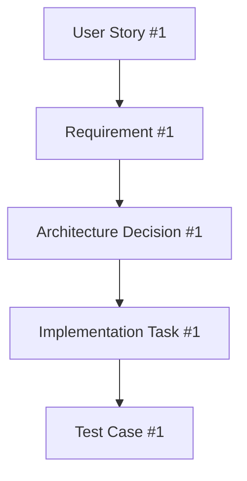

# Specification-Driven Development (SDD) Methodology

> The core philosophy of forge-sdd-toolkit

## What is SDD?

**Specification-Driven Development** is a methodology where:
1. **Natural language specification** drives the entire development process
2. **Every artifact** is generated from specifications, not coded manually
3. **LLMs orchestrate** the translation from intent to implementation
4. **Iterations refine** specifications, not code directly

## SDD Principles for Forge Apps

### 1. Specification First, Code Last


### 2. Natural Language as Source of Truth
The user describes WHAT they want, not HOW to build it:
- ✅ "I need a Jira panel that shows PR status from Bitbucket"
- ❌ "Create a REST API call to Bitbucket and render in ForgeUI"

### 3. Cascading Specifications
Each level adds detail without losing abstraction:
```yaml
Level 1 - Intent:
  "Track pull requests in Jira issues"

Level 2 - Specification:
  "Display Bitbucket PR status in Jira issue panel,
   showing state, reviewers, and checks"

Level 3 - Architecture:
  - Module: jira:issuePanel
  - UI: Custom UI (real-time updates needed)
  - APIs: Bitbucket REST API, Jira Properties API
  - Storage: Cache PR data for 5 minutes

Level 4 - Implementation:
  [Actual code generated from above specs]
```

## SDD Lifecycle Stages

### Stage 1: IDEATE (forge-ideate)
**Input**: Raw user idea in natural language
**Process**: Transform idea into formal specification
**Output**: Structured specification document

```markdown
# Specification Document Structure
## Objective
What the app should accomplish

## User Stories
- As a [user], I want [feature], so that [value]

## Functional Requirements
- Must have X
- Should support Y
- Could include Z

## Non-Functional Requirements
- Performance targets
- Security needs
- Scalability requirements
```

### Stage 2: ARCHITECT (forge-architect)
**Input**: Specification document
**Process**: Make technical decisions
**Output**: Architecture Decision Document (ADD)

```markdown
# Architecture Decision Document
## Module Selection
- Chosen: jira:issuePanel
- Reason: Needs to display in issue context

## UI Framework Decision
- Chosen: Custom UI
- Reason: Rich interactivity required

## Data Flow Architecture
- Source → Processing → Storage → Display

## API Integration Points
- Jira REST API: For issue data
- Bitbucket API: For PR information
- Forge Storage: For caching
```

### Stage 3: PLAN (forge-plan)
**Input**: Architecture Decision Document
**Process**: Create implementation roadmap
**Output**: Backlog and sprint plan

```markdown
# Implementation Plan
## Backlog
### Epic 1: Core Functionality
- Story 1.1: Setup Forge app structure
- Story 1.2: Implement Bitbucket integration
- Story 1.3: Create issue panel UI

### Epic 2: Enhanced Features
- Story 2.1: Add caching layer
- Story 2.2: Implement real-time updates

## Sprint Plan
### Sprint 1 (Foundation)
- Tasks with effort estimates
### Sprint 2 (Core Features)
- Prioritized deliverables
```

### Stage 4: IMPLEMENT (forge-implement)
**Input**: Plan + Architecture + Specification
**Process**: Generate actual code
**Output**: Working Forge app code

```typescript
// Generated based on all previous specifications
// Not written manually, but derived from specs
```

### Stage 5: TEST (forge-test)
**Input**: Implementation + Specification
**Process**: Generate test strategy and cases
**Output**: Test suite and validation

```markdown
# Test Strategy
## Unit Tests
- Generated from functional requirements

## Integration Tests  
- Based on architecture decisions

## User Acceptance Tests
- Derived from user stories
```

### Stage 6: OPERATE (forge-operate)
**Input**: Complete implementation
**Process**: Setup deployment and monitoring
**Output**: CI/CD configuration and ops playbook

```yaml
# Deployment Configuration
# Monitoring Setup
# Performance Benchmarks
# Incident Response Procedures
```

## SDD Rules for Copilot

### Rule 1: Never Skip Stages
Each stage builds on the previous. Never jump from ideation to code.

### Rule 2: Specifications Drive Decisions
Every technical choice must trace back to a specification requirement.

### Rule 3: Maintain Traceability


### Rule 4: Iterate at Specification Level
When changes are needed:
1. Update the specification
2. Cascade changes through stages
3. Regenerate affected artifacts

### Rule 5: Context Accumulation
Each stage adds context for the next:
```yaml
Stage 1 Output → Stage 2 Input
Stage 2 Output → Stage 3 Input (includes Stage 1 context)
Stage 3 Output → Stage 4 Input (includes Stage 1+2 context)
# And so on...
```

## SDD Prompt Engineering

### For Ideation Prompts
```markdown
Given: [user's natural language description]
Extract:
1. Core objective
2. User personas
3. Success criteria
4. Constraints
Generate: Formal specification document
```

### For Architecture Prompts
```markdown
Given: [specification document]
Analyze:
1. Technical requirements
2. Platform constraints
3. Performance needs
Decide:
1. Forge modules to use
2. UI framework (UI Kit vs Custom UI)
3. Storage strategy
4. API integration approach
Generate: Architecture Decision Document
```

### For Implementation Prompts
```markdown
Given: [specification + architecture + plan]
Reference:
- Templates for patterns
- Specializations for specific modules
Generate:
- Complete, working code
- No placeholders or TODOs
- Full error handling
- Performance optimizations
```

## SDD Quality Gates

### Gate 1: Specification Completeness
- [ ] All user stories defined
- [ ] Success criteria measurable
- [ ] Constraints documented
- [ ] Non-functional requirements clear

### Gate 2: Architecture Consistency
- [ ] All decisions justified by specs
- [ ] No conflicting choices
- [ ] Performance targets achievable
- [ ] Security model defined

### Gate 3: Implementation Coverage
- [ ] All specifications implemented
- [ ] No missing features
- [ ] Error cases handled
- [ ] Performance targets met

## SDD Benefits for Forge Development

1. **Faster Development**: No time wasted on wrong implementations
2. **Better Quality**: Requirements clear before coding starts
3. **Easier Maintenance**: Changes happen at spec level
4. **Knowledge Capture**: Specifications document intent
5. **LLM Optimization**: Clear context for AI assistance

## Common SDD Patterns

### Pattern: Feature Addition
```
1. Update specification with new feature
2. Revise architecture if needed
3. Adjust plan for new scope
4. Generate new implementation
5. Extend test coverage
```

### Pattern: Performance Optimization
```
1. Update non-functional requirements
2. Revise architecture for performance
3. Plan optimization tasks
4. Regenerate affected code
5. Add performance tests
```

### Pattern: Platform Migration
```
1. Update constraints in specification
2. New architecture for target platform
3. Migration plan creation
4. Generate platform-specific code
5. Migration validation tests
```

## Remember

SDD is about **thinking before coding**. The toolkit enforces this by:
- Requiring complete specifications before implementation
- Making all decisions traceable to requirements
- Generating code from specs, not writing manually
- Iterating at the specification level, not code level

This methodology ensures that every line of code has a purpose traced back to user intent.