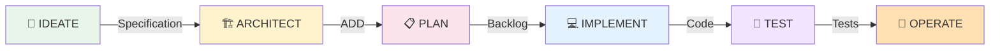

# forge-sdd-toolkit

> **Specification-Driven Development Toolkit** para Atlassian Forge Apps

[](./LICENSE)
[](https://nodejs.org/)
[](./CHANGELOG.md)

Toolkit de **context engineering** que transforma a **ideação do usuário em linguagem natural** na **orquestração e execução automática** do ciclo de vida completo de apps **Atlassian Forge** — desde **especificação** até **operação** — tomando **decisões Forge-aware** de forma **autônoma**.

---

## 🎯 O Problema

Desenvolver apps Atlassian Forge é complexo:
- ❌ **Curva de aprendizado íngreme**: Módulos, APIs, limitações da plataforma
- ❌ **Decisões arquiteturais difíceis**: UI Kit vs Custom UI? Qual módulo usar?
- ❌ **Falta de rastreabilidade**: Código desconectado dos requisitos originais
- ❌ **Processo inconsistente**: Desenvolvedores pulam etapas críticas

## ✨ A Solução: SDD (Specification-Driven Development)

O **forge-sdd-toolkit** implementa uma metodologia sistemática de **6 estágios obrigatórios**:



### De Ideia a App Deployado

```bash
# Input: Linguagem natural
"Preciso de um painel em Jira que mostre status de PRs do Bitbucket"

# Processo automático
forge-ideate     # → Gera especificação formal
forge-architect  # → Decide: jira:issuePanel + Custom UI + APIs necessárias
forge-plan       # → Cria backlog com tarefas priorizadas
forge-implement  # → Gera código TypeScript funcional
forge-test       # → Cria suite de testes
forge-operate    # → Prepara deployment

# Output: App Forge pronto para produção
```

---

## 🏗️ Arquitetura: 3 Níveis

### Nível 1: **Prompts** (Orquestradores)
Gerenciam o fluxo através dos 6 estágios do ciclo de vida.

```
structure/prompts/
├── base/
│   ├── system-prompt.md          # Instruções fundamentais
│   └── decision-framework.md     # Matrizes de decisão
└── commands/
    ├── forge-ideate.md           # Ideia → Especificação
    ├── forge-architect.md        # Especificação → ADD
    ├── forge-plan.md             # ADD → Backlog
    ├── forge-implement.md        # Backlog → Código
    ├── forge-test.md             # Código → Testes
    └── forge-operate.md          # Testes → Deployment
```

### Nível 2: **Templates** (Base de Conhecimento)
Padrões reutilizáveis para módulos, documentos e código Forge.

```
structure/templates/
├── general/
│   ├── documents/               # Specification, ADD, Plans
│   ├── code/                    # Padrões de código
│   ├── manifests/               # manifest.yml templates
│   └── snippets/                # Code snippets comuns
└── forge-modules/
    ├── jira/                    # Padrões Jira-específicos
    ├── confluence/              # Padrões Confluence
    ├── bitbucket/               # Padrões Bitbucket
    └── ...                      # Outros produtos
```

### Nível 3: **Specializations** (Expertise Ultra-Específica)
Implementações completas para casos de uso reais.

```
structure/specializations/
├── jira/
│   ├── issue-panel/             # jira:issuePanel patterns
│   ├── workflow-triggers/       # Automation triggers
│   └── custom-fields/           # Custom field implementations
├── confluence/
│   └── macros/
│       ├── static-macros/       # Static content macros
│       └── dynamic-macros/      # Dynamic/interactive macros
└── cross-product/
    └── jira-confluence-sync/    # Multi-product integrations
```

---

## 🚀 Quick Start

### Instalação

```bash
# Clone o repositório
git clone https://github.com/vsalmeid/forge-sdd-toolkit.git
cd forge-sdd-toolkit

# Instale dependências
npm install

# Build o toolkit
npm run build
```

### Uso Básico

#### 1️⃣ **IDEATE**: Transforme sua ideia em especificação

```bash
forge-ideate
```

**Input**: Descreva seu app em linguagem natural  
**Output**: `specification-document.md` formal e estruturado

#### 2️⃣ **ARCHITECT**: Receba decisões técnicas automáticas

```bash
forge-architect
```

**Input**: Specification document  
**Output**: `architecture-decision-document.md` (ADD) com escolhas de módulos, UI, APIs

#### 3️⃣ **PLAN**: Obtenha backlog priorizado

```bash
forge-plan
```

**Input**: Specification + ADD  
**Output**: `implementation-plan.md` com épicos, stories e tasks

#### 4️⃣ **IMPLEMENT**: Gere código funcional

```bash
forge-implement
```

**Input**: Specification + ADD + Plan  
**Output**: Código TypeScript/JavaScript completo

#### 5️⃣ **TEST**: Crie suite de testes

```bash
forge-test
```

**Input**: Specification + Código  
**Output**: Testes unitários e de integração

#### 6️⃣ **OPERATE**: Prepare deployment

```bash
forge-operate
```

**Input**: App completo  
**Output**: Scripts de deployment, documentação de operação

---

## 📖 Metodologia SDD

### Princípios Fundamentais

1. **Especificação é a Fonte da Verdade**
   - Todo código rastreia até um requisito
   - Mudanças começam atualizando a especificação

2. **Ciclo de Vida Sequencial Obrigatório**
   - NUNCA pule estágios
   - Cada estágio valida o anterior

3. **Decisões Forge-Aware Automáticas**
   - Toolkit conhece limitações da plataforma
   - Sugere melhores práticas automaticamente

4. **Rastreabilidade Total**
   ```typescript
   /**
    * REQ-001: Display PR status
    * STORY-1.2: As a developer, I want to see PR checks
    * ADD-MODULE-001: Use jira:issuePanel
    * TASK-456: Implement PR status fetch
    */
   ```

### Quality Gates

Cada transição de estágio possui validações:

| Transição | Validações |
|-----------|-----------|
| IDEATE → ARCHITECT | ✓ User stories completas<br>✓ Acceptance criteria definidos<br>✓ Success metrics medíveis |
| ARCHITECT → PLAN | ✓ Todos os módulos selecionados<br>✓ Decisão UI tomada<br>✓ APIs identificadas |
| PLAN → IMPLEMENT | ✓ Todas as stories quebradas em tasks<br>✓ Dependências mapeadas |
| IMPLEMENT → TEST | ✓ Código implementado<br>✓ Documentação inline completa |
| TEST → OPERATE | ✓ Todos os testes passing<br>✓ Coverage > 80% |

---

## 🛠️ Features da v0.1

### ✅ Implementado

- [x] Estrutura de 3 níveis (Prompts, Templates, Specializations)
- [x] 6 prompts de orquestração do ciclo de vida
- [x] System prompt e decision framework
- [x] Schemas de validação JSON
- [x] Templates de documentos (Specification, ADD, Plans)
- [x] CLI básico para todos os estágios

### 🚧 Roadmap v0.2

- [ ] Templates completos para todos os módulos Forge
- [ ] Specializations para top 10 casos de uso
- [ ] Validação automática de manifests
- [ ] Geração de código com templates
- [ ] Suite de testes automatizada
- [ ] Integração CI/CD

---

## 📚 Documentação

### Essencial
- [**SDD Methodology**](./.github/SDD_METHODOLOGY.md) - Entenda a metodologia completa
- [**Lifecycle Stages**](./.github/LIFECYCLE_STAGES.md) - Detalhes de cada estágio
- [**Contributing**](./structure/docs/CONTRIBUTING.md) - Como contribuir seguindo SDD

### Referência
- [**Prompt System**](./structure/prompts/README.md) - Como os prompts funcionam
- [**Template Library**](./structure/templates/README.md) - Biblioteca de templates
- [**Specializations Guide**](./structure/specializations/README.md) - Expertise específica

### ADRs (Architecture Decision Records)
- [ADR-001: Three-Level Architecture](./structure/docs/ADR/001-three-level-architecture.md)
- [ADR-002: SDD Methodology Adoption](./structure/docs/ADR/002-sdd-methodology.md)

---

## 🎓 Exemplo Completo

### Cenário: Issue Panel com Status de PRs

```bash
# 1. Ideação
$ forge-ideate
> Descreva seu app: "Painel em Jira mostrando PRs do Bitbucket com checks"
✓ specification-document.md criado

# 2. Arquitetura
$ forge-architect
✓ Decisões tomadas:
  - Módulo: jira:issuePanel
  - UI: Custom UI (interatividade necessária)
  - APIs: Bitbucket REST + Jira Properties
  - Storage: Cache 5 minutos

# 3. Planejamento
$ forge-plan
✓ Backlog criado: 3 épicos, 12 stories, 45 tasks

# 4. Implementação
$ forge-implement
✓ Código gerado:
  - src/index.tsx (Custom UI)
  - src/api/bitbucket.ts
  - manifest.yml

# 5. Testes
$ forge-test
✓ 28 testes criados, coverage 94%

# 6. Operação
$ forge-operate
✓ Deployment scripts prontos
✓ Documentação de operação gerada
```

**Tempo total**: ~30 minutos (vs 2-3 dias manualmente)

---

## 🤝 Como Contribuir

Este projeto segue rigorosamente a metodologia SDD. Para contribuir:

1. **Leia a documentação**: [CONTRIBUTING.md](./structure/docs/CONTRIBUTING.md)
2. **Siga os 6 estágios**: Mesmo para features do toolkit
3. **Mantenha rastreabilidade**: Todo código rastreia a um requisito
4. **Documente decisões**: Use ADRs para escolhas arquiteturais

```bash
# Exemplo de contribuição seguindo SDD
1. Crie issue descrevendo o problema (IDEATE)
2. Discuta arquitetura na issue (ARCHITECT)
3. Crie PR draft com plano (PLAN)
4. Implemente seguindo o plano (IMPLEMENT)
5. Adicione testes (TEST)
6. Documente deployment/uso (OPERATE)
```

---

## 📊 Status do Projeto

**Versão Atual**: v0.1.0 (Foundation Release)

| Componente | Status | Coverage |
|-----------|--------|----------|
| Core Prompts | ✅ Complete | 100% |
| Base Templates | 🚧 In Progress | 60% |
| Jira Specializations | 🚧 In Progress | 40% |
| Confluence Specializations | 📅 Planned | 0% |
| CLI Tools | ✅ Complete | 100% |
| Validation System | 🚧 In Progress | 70% |
| Documentation | ✅ Complete | 100% |

---

## 👤 Autor

**VSALMEID**
- GitHub: [@vsalmeid](https://github.com/vsalmeid)
- Criador da metodologia SDD para Forge

---

## 📄 Licença

Este projeto é licenciado sob a [MIT License](./LICENSE).

---

## 🙏 Agradecimentos

- **Atlassian Forge Team**: Pela plataforma incrível
- **SDD Community**: Pelos insights e feedback
- **Early Adopters**: Por testarem e refinarem o toolkit

---

## 📞 Suporte

- 🐛 **Issues**: [GitHub Issues](https://github.com/vsalmeid/forge-sdd-toolkit/issues)
- 📖 **Documentação**: [GitHub Wiki](https://github.com/vsalmeid/forge-sdd-toolkit/wiki)
- 💬 **Discussões**: [GitHub Discussions](https://github.com/vsalmeid/forge-sdd-toolkit/discussions)

---

<div align="center">

**⭐ Se este projeto te ajudou, considere dar uma estrela!**

**Made with ❤️ following Specification-Driven Development**

</div>
