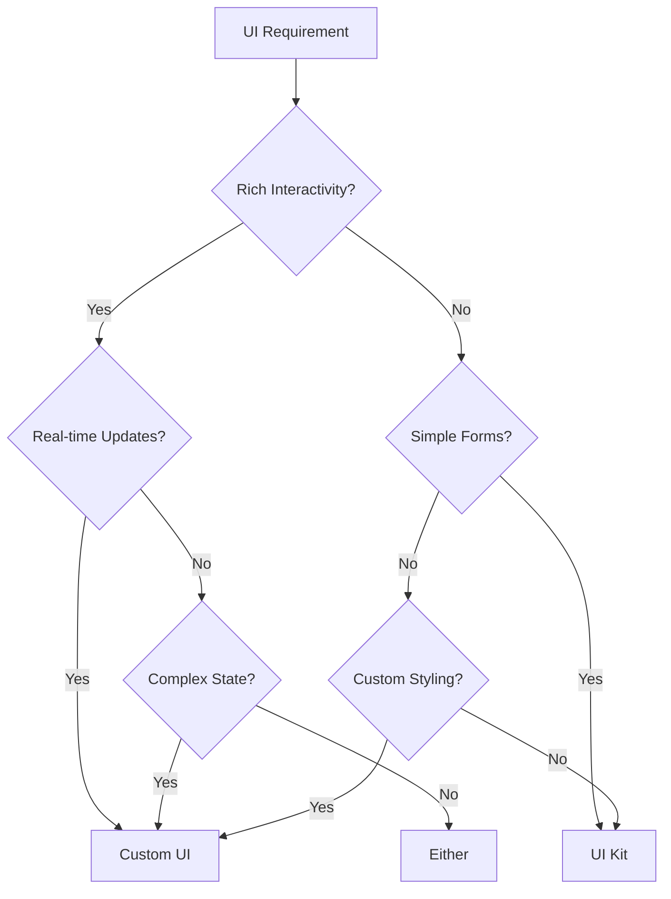
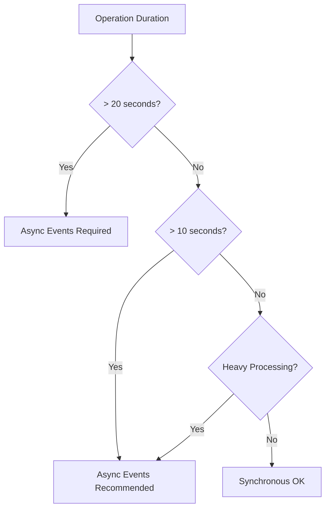

# Forge Decision Framework

## Module Selection Matrix

### When to Use Each Module Type

| Use Case | Recommended Module | Why |
|----------|-------------------|-----|
| Display in issue context | jira:issuePanel | Native integration |
| Respond to issue changes | trigger:issueUpdated | Real-time events |
| Add custom data to issues | jira:customField | Structured storage |
| Automate workflows | workflow:trigger | Process automation |
| Display in Confluence | confluence:macro | Content enhancement |
| Global navigation | common:globalPage | Cross-product access |

## UI Framework Decision Tree



### UI Kit Characteristics
- ✅ Server-side rendered
- ✅ Built-in Atlassian components
- ✅ Automatic theming
- ✅ Simpler security model
- ❌ Limited interactivity
- ❌ No custom styling
- ❌ Limited component set

### Custom UI Characteristics
- ✅ Full React capabilities
- ✅ Rich interactions
- ✅ Custom styling
- ✅ Any npm package (within limits)
- ❌ More complex setup
- ❌ Requires bridge for API calls
- ❌ Larger bundle size

## Storage Strategy Selection

### Decision Criteria

| Need | Solution | Limits |
|------|----------|---------|
| User preferences | Forge Storage | 100KB/key |
| Temporary cache | Forge Storage with TTL | Clean up old data |
| Issue metadata | Entity Properties | 32KB/property |
| Large datasets | External API | Your infrastructure |
| Cross-product data | App Storage | Scoped per product |

## Performance Optimization Decisions

### When to Use Async Events



## Security Scope Minimization

### Principle: Request Minimum Necessary

| Operation | Minimum Scope | Avoid |
|-----------|--------------|-------|
| Read issues | read:jira-work | admin:jira |
| Update issues | write:jira-work | admin:jira |
| Read user info | read:me | read:account |
| Store app data | storage:app | storage:user |

### Scope Escalation Strategy
1. Start with read-only scopes
2. Add write scopes only when needed
3. Request admin scopes as last resort
4. Document why each scope is necessary

## API Selection Guide

### REST vs GraphQL

| Scenario | Use REST | Use GraphQL |
|----------|----------|-------------|
| Simple CRUD | ✅ | ✅ |
| Complex queries | ❌ | ✅ |
| Bulk operations | ✅ | ❌ |
| Real-time subscriptions | ❌ | Planned |
| Legacy endpoints | ✅ | ❌ |

## Module Grouping Strategy

### By Product vs By Function

**By Product** (Recommended for):
- Product-specific features
- Single-product apps
- Specialized workflows

**By Function** (Recommended for):
- Cross-product features
- Utility apps
- Reporting/analytics

## Rate Limit Management

### Strategy Selection

| API Calls/Minute | Strategy |
|------------------|----------|
| < 10 | Direct calls |
| 10-50 | Basic caching |
| 50-200 | Aggressive caching + batching |
| > 200 | Async processing + queues |

## Decision Documentation Template

```markdown
## Decision: [Title]
**Date**: YYYY-MM-DD
**Stage**: [ARCHITECT/PLAN]
**Requirement**: [REQ-XXX]

### Options Considered
1. Option A - Description
2. Option B - Description

### Decision
Chosen: Option A

### Rationale
- Reason 1
- Reason 2

### Trade-offs
- Gaining: X
- Losing: Y

### Consequences
- Short-term: Impact
- Long-term: Impact
```

Remember: Every decision must trace back to a requirement from the IDEATE stage.