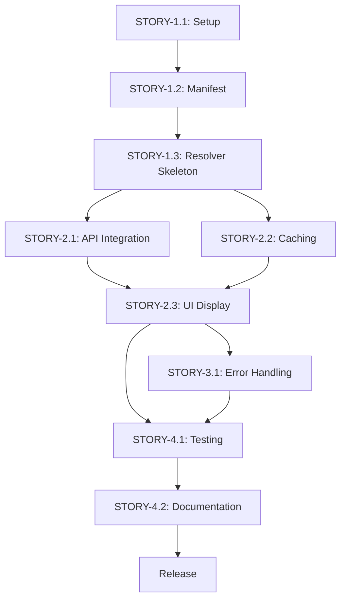

# Implementation Plan

**Project**: [App Name]  
**Created**: [Date]  
**Author**: [Tech Lead Name]  
**Based on**: 
- Specification: `specification-[app-name].md`
- Architecture: `ADD-[app-name].md`

**Status**: Draft | Under Review | Approved | In Progress | Complete

---

## Executive Summary

**Goal**: Implement [app name] as specified in the specification and architected in the ADD.

**Total Effort**: [X] story points / [Y] hours

**Timeline**: [Start date] → [End date] ([Z] weeks)

**Team**: [Number] developers

**Milestones**:
1. [Milestone 1] - [Date]
2. [Milestone 2] - [Date]
3. [Release] - [Date]

---

## 1. Epic Breakdown

### Epic 1: Foundation & Setup
**Goal**: Project infrastructure and base configuration

**User Value**: Enables all development work

**Estimated Effort**: [X hours]

**Stories**: STORY-1.1, STORY-1.2, STORY-1.3

---

### Epic 2: [Core Feature Name]
**Goal**: [Description]

**User Value**: [Direct benefit to users]

**Traces to**: REQ-F-001, REQ-F-002

**Estimated Effort**: [X hours]

**Stories**: STORY-2.1, STORY-2.2, STORY-2.3

---

### Epic 3: [Secondary Feature Name]
**Goal**: [Description]

**User Value**: [Direct benefit to users]

**Traces to**: REQ-F-003

**Estimated Effort**: [X hours]

**Stories**: STORY-3.1, STORY-3.2

---

### Epic 4: Quality & Polish
**Goal**: Testing, error handling, documentation

**User Value**: Reliable, maintainable app

**Estimated Effort**: [X hours]

**Stories**: STORY-4.1, STORY-4.2, STORY-4.3

---

## 2. User Stories & Tasks

### STORY-1.1: Project Setup
**As a** developer  
**I want** the project properly configured  
**So that** I can start implementing features

**Acceptance Criteria**:
- [ ] Forge app created and manifest configured
- [ ] TypeScript setup complete
- [ ] ESLint and Prettier configured
- [ ] Git repository initialized

**Estimated Effort**: 4 hours

**Priority**: P0 (Must-have)

**Dependencies**: None

**Tasks**:

#### TASK-1.1.1: Create Forge App
**Description**: Initialize new Forge app with correct modules

**Technical Details**:
```bash
forge create
# Select: Custom UI / UI Kit based on ADD-UI-001
# Select: jira:issuePanel based on ADD-MODULE-001
```

**Deliverable**: 
- `manifest.yml` with correct modules and permissions
- Initial project structure

**Estimated Time**: 1 hour

**Assigned to**: [Developer]

**Traces to**: ADD-MODULE-001, ADD-UI-001

---

#### TASK-1.1.2: Configure TypeScript
**Description**: Setup TypeScript with strict mode

**Technical Details**:
- Target: ES2022
- Module: ESNext
- Strict: true
- Source maps enabled

**Deliverable**: 
- `tsconfig.json` configured
- Compiles without errors

**Estimated Time**: 1 hour

**Assigned to**: [Developer]

---

#### TASK-1.1.3: Setup Linting
**Description**: Configure ESLint and Prettier

**Deliverable**:
- `.eslintrc.json` with TypeScript parser
- `.prettierrc.json` with team standards
- Pre-commit hooks (optional)

**Estimated Time**: 1 hour

**Assigned to**: [Developer]

---

#### TASK-1.1.4: Initialize Git Repository
**Description**: Setup version control

**Deliverable**:
- `.gitignore` configured
- Initial commit
- Main branch protection (if team repo)

**Estimated Time**: 1 hour

**Assigned to**: [Developer]

---

### STORY-1.2: Manifest Configuration
**As a** developer  
**I want** the manifest properly configured with minimum scopes  
**So that** the app has correct permissions and modules

**Acceptance Criteria**:
- [ ] All modules from ADD configured
- [ ] Only necessary scopes requested (ADD-SEC-002)
- [ ] App key and name set
- [ ] Manifest validates with `forge lint`

**Estimated Effort**: 3 hours

**Priority**: P0

**Dependencies**: STORY-1.1

**Tasks**:

#### TASK-1.2.1: Configure Modules
**Description**: Add all modules from ADD-MODULE-001

**Technical Details**:
```yaml
# From ADD-MODULE-001: jira:issuePanel
modules:
  jira:issuePanel:
    - key: [panel-key]
      title: [Panel Title]
      icon: [icon-url]
      resolver:
        function: main
```

**Deliverable**: Modules section complete in manifest.yml

**Estimated Time**: 1.5 hours

**Traces to**: ADD-MODULE-001

---

#### TASK-1.2.2: Configure Permissions
**Description**: Set minimum necessary scopes per ADD-SEC-002

**Technical Details**:
```yaml
permissions:
  scopes:
    - read:jira-work
    - storage:app
    # Only scopes from ADD-SEC-002
```

**Deliverable**: Permissions validated against ADD

**Estimated Time**: 1 hour

**Traces to**: ADD-SEC-002

---

#### TASK-1.2.3: Validate Manifest
**Description**: Ensure manifest is valid

**Technical Details**:
```bash
forge lint
```

**Deliverable**: Manifest passes all validations

**Estimated Time**: 0.5 hours

---

### STORY-2.1: [Feature Story]
**As a** [user role from specification]  
**I want** [functionality]  
**So that** [value]

**Acceptance Criteria**: [From specification]
- [ ] AC-2.1.1: [Criterion]
- [ ] AC-2.1.2: [Criterion]
- [ ] AC-2.1.3: [Criterion]

**Estimated Effort**: [X hours]

**Priority**: P0 | P1 | P2

**Dependencies**: [Previous stories]

**Traces to**: REQ-F-XXX (from specification)

**Architecture References**: ADD-XXX-XXX (from ADD)

**Tasks**:

#### TASK-2.1.1: [Task Title]
**Description**: [What needs to be done]

**Technical Details**:
[Code snippets, algorithms, APIs to use]

**Deliverable**: 
[Specific output - file, function, component]

**Estimated Time**: 2-8 hours (per task guidelines)

**Assigned to**: [Developer]

**Traces to**: 
- Requirement: REQ-F-XXX
- Architecture: ADD-XXX-XXX
- Acceptance Criteria: AC-2.1.X

---

[Repeat task structure for each task in the story]

---

## 3. Implementation Phases

### Phase 1: Foundation (Week 1)
**Goal**: Infrastructure and basic setup

**Stories**: STORY-1.1, STORY-1.2, STORY-1.3

**Deliverables**:
- [ ] Project setup complete
- [ ] Manifest configured and validated
- [ ] Basic resolver skeleton

**Success Criteria**:
- [ ] `forge deploy` succeeds
- [ ] App installs in development environment
- [ ] No errors in `forge logs`

---

### Phase 2: Core Features (Weeks 2-3)
**Goal**: Implement primary functionality

**Stories**: STORY-2.1, STORY-2.2, STORY-2.3

**Deliverables**:
- [ ] API integration working
- [ ] Caching implemented
- [ ] UI displays data

**Success Criteria**:
- [ ] All P0 acceptance criteria met
- [ ] Performance targets achieved
- [ ] Error handling in place

---

### Phase 3: Polish & Testing (Week 4)
**Goal**: Quality assurance and documentation

**Stories**: STORY-4.1, STORY-4.2, STORY-4.3

**Deliverables**:
- [ ] Test suite complete (>80% coverage)
- [ ] Documentation written
- [ ] User guide created

**Success Criteria**:
- [ ] All tests passing
- [ ] No critical bugs
- [ ] Ready for beta deployment

---

## 4. Task Dependency Graph



**Critical Path**: STORY-1.1 → STORY-1.2 → STORY-2.1 → STORY-2.3 → STORY-4.1 → Release

---

## 5. Effort Estimation

### Summary by Epic

| Epic | Stories | Tasks | Hours | % of Total |
|------|---------|-------|-------|------------|
| Epic 1: Foundation | 3 | 8 | 20h | 25% |
| Epic 2: Core Features | 4 | 12 | 40h | 50% |
| Epic 3: Secondary Features | 2 | 5 | 10h | 12% |
| Epic 4: Quality & Polish | 3 | 5 | 10h | 13% |
| **Total** | **12** | **30** | **80h** | **100%** |

### Estimation Methodology

**Task Sizing Guidelines**:
- Small task: 2 hours (simple function, configuration)
- Medium task: 4 hours (API integration, component)
- Large task: 8 hours (complex feature, multiple dependencies)

**Confidence Levels**:
- 🟢 High confidence: Foundation tasks (done this before)
- 🟡 Medium confidence: Core features (some unknowns)
- 🔴 Low confidence: None (architecture is clear)

### Buffer

**Contingency**: 20% (16 hours)
- Unforeseen issues: 10 hours
- Integration bugs: 4 hours
- Rework: 2 hours

**Total with Buffer**: 96 hours (~12 days for 1 developer)

---

## 6. Risk Management

### Risk 1: [Risk from ADD or new risk]
**Likelihood**: High | Medium | Low  
**Impact**: High | Medium | Low

**Mitigation**:
- Action 1: [Preventive measure]
- Action 2: [Contingency plan]

**Tasks Affected**: [List of task IDs]

---

### Risk 2: External API Rate Limiting
**Likelihood**: Medium  
**Impact**: Medium

**Mitigation**:
- Implement aggressive caching first (TASK-2.2.1)
- Test with realistic load early (TASK-4.1.2)
- Have fallback to stale cache (TASK-3.1.1)

**Tasks Affected**: TASK-2.1.1, TASK-2.2.1

---

## 7. Quality Gates

### Gate 1: Foundation Complete
**Criteria**:
- [ ] All STORY-1.x complete
- [ ] App deploys successfully
- [ ] Manifest validated
- [ ] Code review passed

**Approver**: [Tech Lead]

---

### Gate 2: Core Features Complete
**Criteria**:
- [ ] All P0 stories complete
- [ ] All acceptance criteria met
- [ ] Performance targets achieved
- [ ] No critical bugs

**Approver**: [Tech Lead + Product Owner]

---

### Gate 3: Ready for Beta
**Criteria**:
- [ ] All stories complete
- [ ] Test coverage > 80%
- [ ] Documentation complete
- [ ] User guide written

**Approver**: [Tech Lead + Product Owner + QA]

---

## 8. Development Guidelines

### Code Standards

**File Organization**:
```
src/
├── resolvers/
│   ├── index.ts          # Main resolver
│   └── [feature].ts      # Feature-specific resolvers
├── services/
│   ├── api.ts            # External API calls
│   └── cache.ts          # Caching logic
├── utils/
│   └── helpers.ts        # Utility functions
└── types/
    └── index.ts          # TypeScript types
```

**Naming Conventions**:
- Functions: camelCase (`fetchPRData`)
- Types: PascalCase (`PullRequest`)
- Constants: UPPER_SNAKE_CASE (`CACHE_TTL`)
- Files: kebab-case (`pull-request-cache.ts`)

**Documentation**:
```typescript
/**
 * Fetches PR data for an issue
 * 
 * @requirement REQ-F-001
 * @architecture ADD-API-001
 * @param issueKey - Jira issue key
 * @returns Array of pull requests
 */
async function fetchPRData(issueKey: string): Promise<PullRequest[]> {
  // Implementation
}
```

---

### Testing Strategy

**Per Task**: Write tests alongside implementation

**Coverage Targets**:
- Unit tests: >80% code coverage
- Integration tests: All API calls
- E2E tests: Critical user flows

**Test Organization**:
```
src/
└── __tests__/
    ├── resolvers/
    ├── services/
    └── utils/
```

---

### Git Workflow

**Branch Naming**:
- Feature: `feature/TASK-X.X.X-short-description`
- Bugfix: `bugfix/issue-description`

**Commit Messages**:
```
[TASK-X.X.X] Brief description

- Detailed change 1
- Detailed change 2

Traces to: REQ-F-XXX, ADD-XXX-XXX
```

**Pull Requests**:
- Title: `[TASK-X.X.X] Task description`
- Link to task in plan
- Include test results
- Request review from [Tech Lead]

---

## 9. Progress Tracking

### Burndown Chart (Manual Update)

| Week | Planned Remaining | Actual Remaining | Notes |
|------|------------------|------------------|-------|
| Week 1 | 80h | [Update] | [Issues/wins] |
| Week 2 | 60h | [Update] | |
| Week 3 | 40h | [Update] | |
| Week 4 | 0h | [Update] | |

---

### Task Status Board

| Task ID | Status | Assigned To | Started | Completed | Notes |
|---------|--------|-------------|---------|-----------|-------|
| TASK-1.1.1 | ☐ Todo / ⏳ In Progress / ✅ Done | [Dev] | [Date] | [Date] | |
| TASK-1.1.2 | ☐ Todo | [Dev] | | | |
| ... | | | | | |

---

## 10. Communication Plan

### Daily Standups
**When**: Daily, 9:00 AM  
**Duration**: 15 minutes  
**Format**:
- What I did yesterday
- What I'm doing today
- Any blockers

---

### Weekly Reviews
**When**: Friday, 2:00 PM  
**Duration**: 1 hour  
**Attendees**: Dev team + Product Owner  
**Agenda**:
- Demo completed stories
- Review burndown
- Adjust plan if needed

---

## 11. Definition of Done

### For Tasks
- [ ] Code written and follows standards
- [ ] Tests written and passing
- [ ] Code reviewed and approved
- [ ] Documentation updated
- [ ] Merged to main branch

---

### For Stories
- [ ] All tasks complete
- [ ] All acceptance criteria met
- [ ] Integration tests passing
- [ ] Demo to Product Owner approved
- [ ] Deployed to dev environment

---

### For Epics
- [ ] All stories complete
- [ ] Epic-level acceptance criteria met
- [ ] Documentation complete
- [ ] Stakeholder sign-off

---

## 12. Approval & Sign-off

### Review Checklist

- [ ] All requirements from specification mapped to tasks
- [ ] All architectural decisions addressed
- [ ] Effort estimates reasonable
- [ ] Dependencies identified
- [ ] Risks mitigated
- [ ] Quality gates defined
- [ ] Timeline achievable

---

### Approvers

| Role | Name | Status | Date |
|------|------|--------|------|
| Tech Lead | [Name] | ☐ Pending / ☑ Approved | [Date] |
| Product Owner | [Name] | ☐ Pending / ☑ Approved | [Date] |
| Team | [Names] | ☐ Pending / ☑ Approved | [Date] |

---

## Appendix

### A. Complete Task List

[Full task index with IDs, titles, and estimates]

### B. Architecture Reference

- Specification: `specification-[app-name].md`
- ADD: `ADD-[app-name].md`

### C. Useful Links

- Forge Documentation: https://developer.atlassian.com/platform/forge/
- Jira project: [link]
- Repository: [link]

---

**Next Step**: Run `forge-implement` to start generating code based on this plan.
